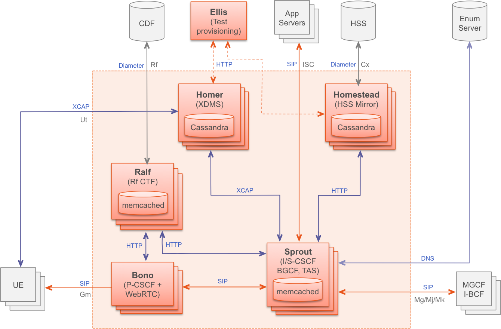
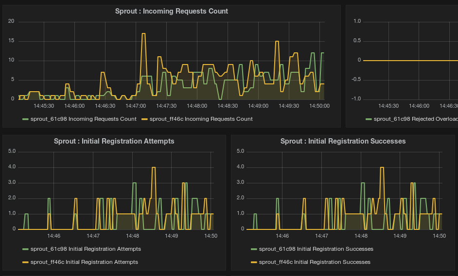

# Clearwater
## Introduction

Clearwater is IMS in the Cloud. [See](http://www.projectclearwater.org/about-clearwater/) more about this solution !


The Clearwater architecture is designed for deployment on cloud environments. It sourced on the best practice  IT software architecture (Load-balancing state-less, easy clustering etc..). [See](http://www.projectclearwater.org/technical/clearwater-architecture/) more about the software architecture of Clearwater !




## Deployment

To deploy the vIMS **Clearwater** you must have previously installed the **Cloudify** orchestrator on OpenStack (see [this docs](cloudify.md)).


### Upload clearwater blueprint 

Log into the host where you installed the **Cloudify CLI** and enter in the virtual environment with source command

Download **blueprint** :
```
cd ~/cloudify/cloudify-manager/
mkdir blueprints
cd blueprints
git clone -b master https://github.com/Orange-OpenSource/opnfv-cloudify-clearwater.git
```
Upload **blueprint** on the orchestrator :
```
cd opnfv-cloudify-clearwater
cfy blueprints upload -b clearwater -p openstack-blueprint.yaml
```

### Create and launch deployment

**Warning !** : For the moment, cloudify doesn't support input parameters to specify the number of node instance to deploy. See the [post](https://groups.google.com/forum/#!topic/cloudify-users/wGbr9kco0qM) on cloudify forum ! 

By default 2 sprout node and 1 node of each other type will be deployed. If you want change it, you can edit deploy: instance on blueprint definition or scale your deployment after launch... 


Before launch the **deployment**, it must be created in cloudify.

For that, must be specified the deployment **inputs parameters**.
A **template** file already exists, you can copy it and complete it to fit with your openstack cloud platform :
```
cp inputs/openstack.yaml.template inputs/inputs.yaml
vi inputs/inputs.yaml
```
Bellow an example of input.yaml file configurations for [CloudWatt](https://www.cloudwatt.com/en/) platform. CloudWatt is a public OpenStack cloud made in France. You can help with this example to generate your configuration file for your OpenStack platform.
```yaml
image_id: 'ae3082cb-fac1-46b1-97aa-507aaa8f184f'      # OS image ID (Ubuntu 14.04)
flavor_id: '17'                                      # Flavor ID (~ 2 Go RAM)
external_network_name: 'public'                     # external network on Openstack
agent_user: 'cloud'                                 # By default is ubuntu for ubuntu image
public_domain: 'clearwater.pub'                     # SIP domain name
```

Once the completed input file, we must **create** the deployment on orchestrator :
```
cfy deployments create -b clearwater -d clearwater-test --inputs inputs/inputs.yaml
```

Then, you have to **launch** clearwater deployment :
```
cfy executions start -w install -d clearwater-test
```

During the deployment many **logs** appears on console :
```
2015-08-27T14:41:03 CFY <clearwater-57> [sprout_host_c68cc.install] Sending task 'diamond_agent.tasks.install'
2015-08-27T14:41:04 CFY <clearwater-57> [sprout_host_c68cc.install] Task started 'diamond_agent.tasks.install'
2015-08-27T14:41:04 CFY <clearwater-57> [bind_296de.configure] Task succeeded 'script_runner.tasks.run'
```


Once the deployment successfully finish, you can create new numbers on ellis website and then register a sip phone (softphone..) 
You can help you with this [clearwater documentation page](https://clearwater.readthedocs.org/en/latest/Making_your_first_call/index.html) (by default the secret_key is "secret").

But to register your softphone, you must use dns of the deployment with his public ip. Or declare the bonos publics IP on your own DNS server. Only bono ip because the private domain fact load-balancing between clearwater VMs.


## Test
### Introduction
To **test** your deployment you can use the [clearwater-live-test](https://clearwater.readthedocs.org/en/latest/Running_the_live_tests/index.html). This test **creates numbers** on ellis and then made different calls to validate deployment. The **result** of this test appears on console during the test.
```
 Basic Call - Mainline (UDP) - (6505550395, 6505550898) Passed
 Basic Call - Tel URIs (TCP) - (6505550449, 6505550796) Passed
 Basic Call - Tel URIs (UDP) - (6505550493, 6505550059) Passed
 Basic Call - Unknown number (TCP) - (6505550405, 6505550862) Passed
```
### Using OPNFV/Functest container 
It's the same test but the installation of all dependancies was already done in this container. In addition, this test provide a json file of all test result.

You can run Functest container in your cloudify cli VM. To do that, you must install docker into this VM :
```
curl -sSL https://get.docker.com/ | sh
```
After that, you can download OPNFV/Functest container image :
```
docker pull opnfv/functest
```
Then you can run the container :
```
docker run --dns=<BIND_PUBLIC_IP> -it opnfv/functest /bin/bash
```
Next you can launch the signaling testing of your deployment :
```
cd ~/repos/vims-test
source /etc/profile.d/rvm.sh
rake test[<YOUR_PUBLIC_DOMAIN_NAME>] SIGNUP_CODE=secret
```


## Scaling

### Manually

With [built-in workflow](http://getcloudify.org/guide/3.2/workflows-built-in.html) on cloudify you can manually **scale** your clearwater deployment.

Before **scale** your deployment, create input file with this parameters :
```
vi scale.yaml
```
```
node_id: sprout
delta: 1 
scale_compute: true
```
This parameters will create one sprout VM and add it on sprout cluster.

Then launch **scale** with this command :
```
cfy executions start -w scale -d clearwater-test -p scale.yaml
```


**Warning !** : For the moment, the bono scale doesn't work correctly because Cloudify don't support "one_to_one" relationships. See the [post](https://groups.google.com/d/msg/cloudify-users/TPqoGZYHEYs/tSrfptDUyKwJ) on cloudify forum ! 

### Auto-Scale
```
 groups:
  clearwater_hosts:
    members: [sprout_host]
    policies:
      mem_scale_policy:
        type: cloudify.policies.types.threshold
        properties:
          service: cpu.total.user
          threshold: 85
        triggers:
          scale_trigger:
            type: cloudify.policies.triggers.execute_workflow
            parameters:
              workflow: scale
              workflow_parameters:
                node_id: sprout
                delta: 1
```
## Monitoring

On **cloudify** 3.2 **non-commercial version**, the dashboard is no longer integrate. But, if you want to display clearwater monitoring informations.  You can install external **Grafana** server and then connect this dashboard to **InfluxDB API** on **cloudify-management-server**.


After, you can use **dashboard model** to display all **clearwater data** :
```
sed 's/clearwater/'<DEPLOYMENT_NAME>'/g' resources/grafana/clearwater-grafana-dashboard.json > clearwater-dashbord.json
```
**Import** 'clearwater-dashboard.json' file on **Grafana dashboard**.



## Uninstall 

Log into the host where you installed the **Cloudify CLI** and enter in the virtual environment with source command

To uninstall properly clearwater deployment, execute this command :
```
cfy executions start -w uninstall -d clearwater-test
```
